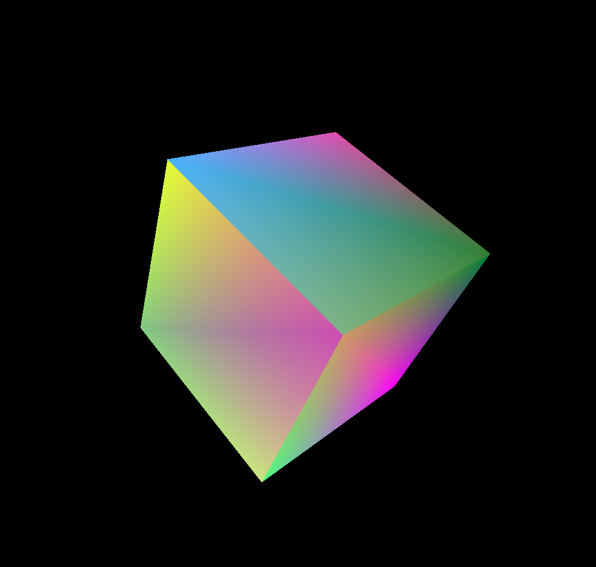

# OpenGL HelloCube

Simple rotating cube using OpenGL. Introductory to OpenGL project to get a better understanding of the graphics pipeline, OpenGL buffers, shaders, and model view projection matrices. 

# Libraries
* GLFW
* GLEW
* GLM

# Credit
Thank you to [Cherno's OpenGL Guide](https://www.youtube.com/watch?v=W3gAzLwfIP0&list=PLlrATfBNZ98foTJPJ_Ev03o2oq3-GGOS2) as well as [Jamie King's 3D Computer Graphics Tutorials](https://www.youtube.com/watch?v=6c1QYZAEP2M&list=PLRwVmtr-pp06qT6ckboaOhnm9FxmzHpbY) for teaching OpenGL and 3D graphics concepts.
